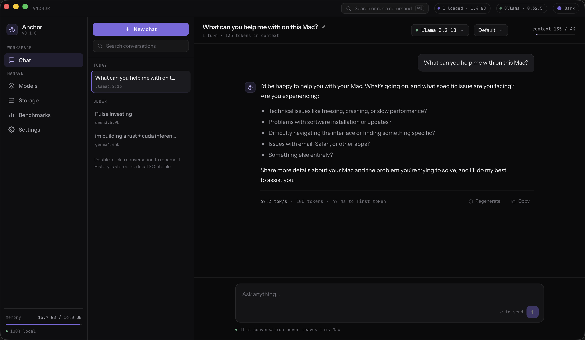
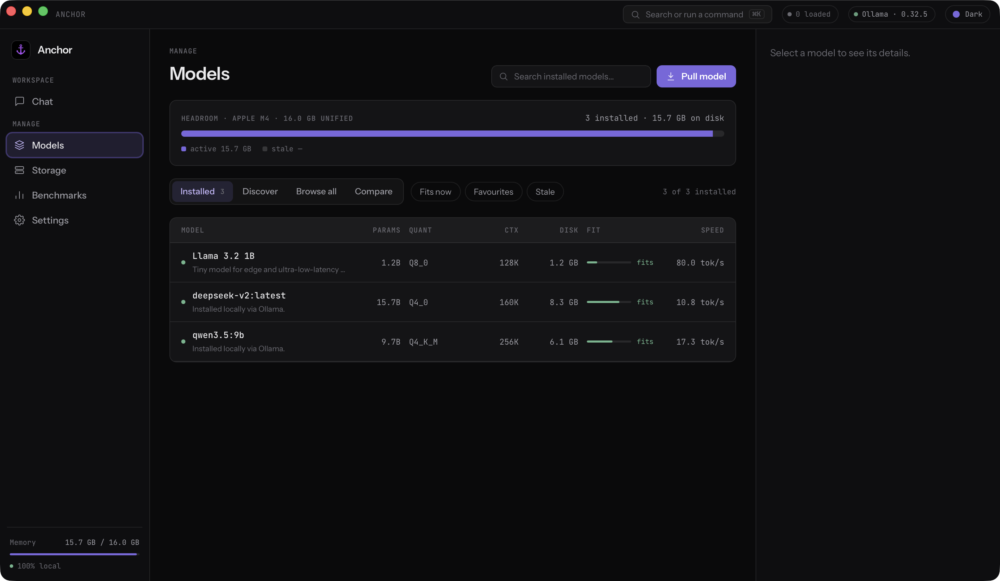
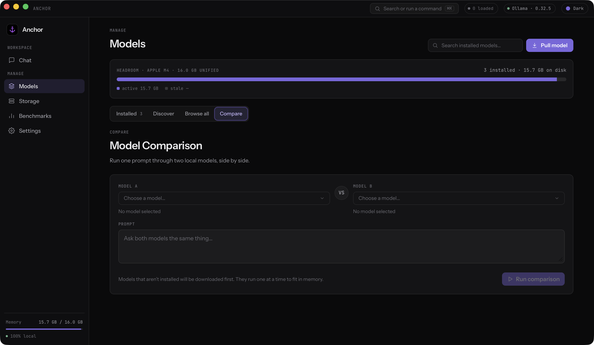
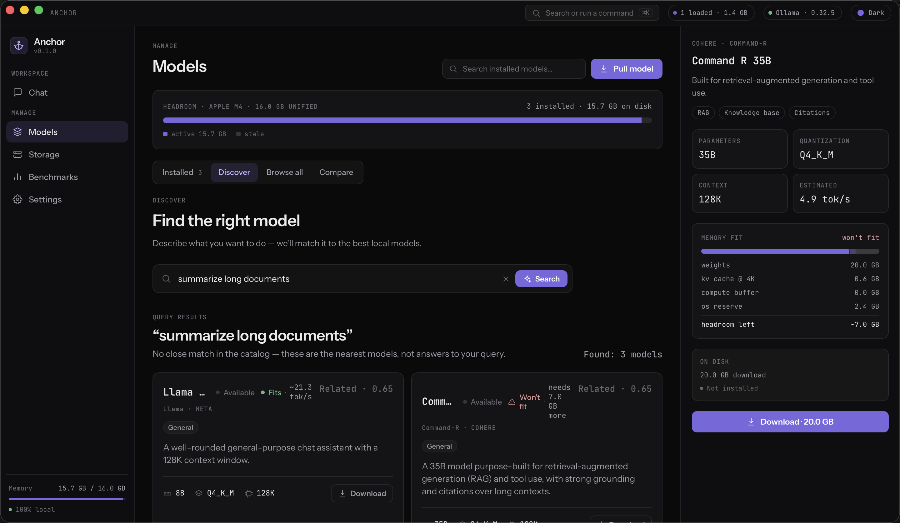
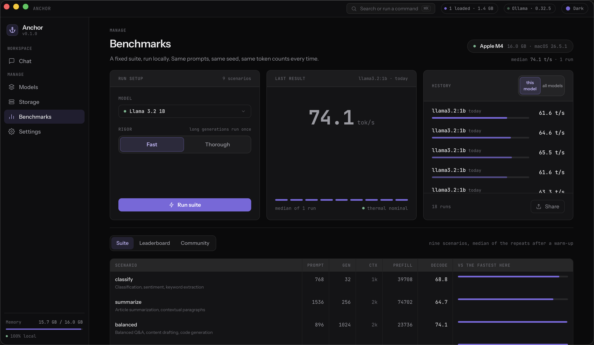
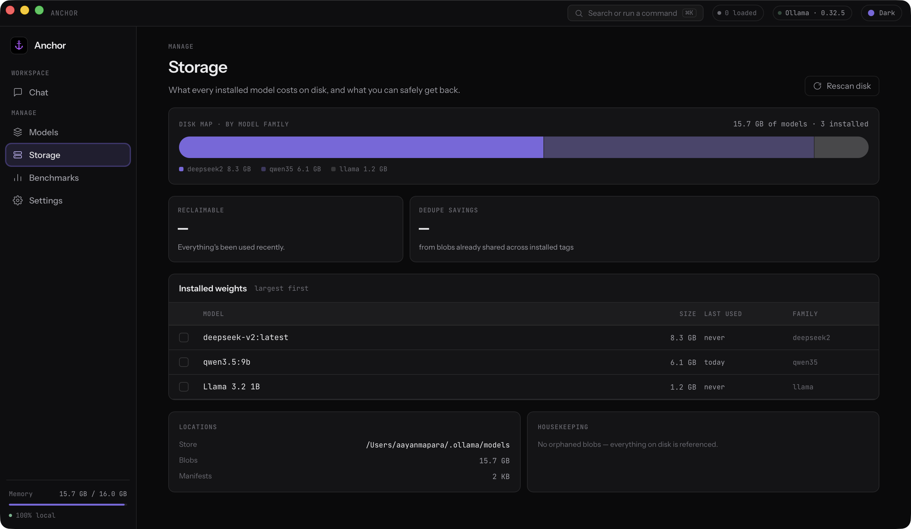
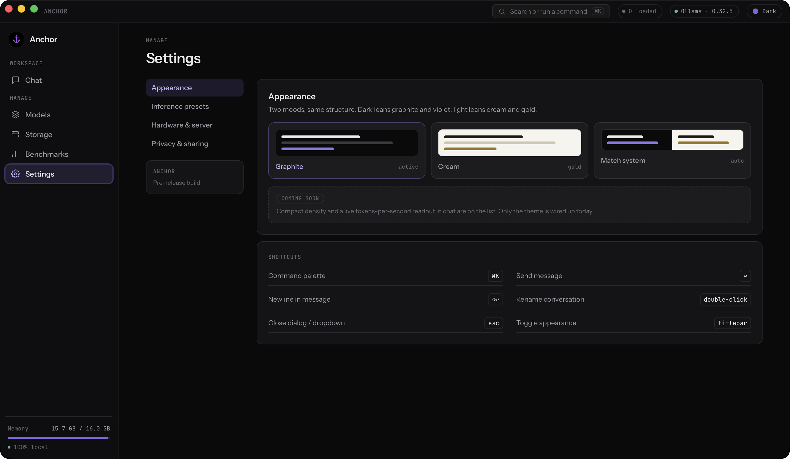

<p align="center">
  <picture>
    <source media="(prefers-color-scheme: dark)" srcset="docs/anchor_dark_word.png">
    
  </picture>
</p>

<h3 align="center">Find, fit, and benchmark local models with ease</h3>

<p align="center">
  
  
  
  
  
  
</p>

> **Status: early-stage.** Signed builds ship from [Releases](https://github.com/amapara27/anchor/releases/latest) and the app updates itself, but interfaces and internals still change often.

## About

Anchor is a native macOS desktop app that acts as a unified control center for local AI. It sits on top of [Ollama](https://ollama.com) and handles the orchestration that makes local models actually usable: discovering and installing models, checking whether one will fit your machine before you pull it, chatting with what you have installed, benchmarking real throughput on your own hardware, and configuring how models behave — all from one place, no terminal required.

It is **not** an inference engine. Ollama does the inference; Anchor is the management layer around it. That boundary is deliberate and it shapes most of the design decisions in the codebase — if a feature would require Anchor to run weights itself, it is out of scope.

Anchor also owns the Ollama server lifecycle: it starts `ollama serve` on launch and shuts it down on quit, so you never need the menubar app or a terminal.

Built for developers, students, researchers, and small business operators who want capable AI running locally without touching a command line. Apple Silicon is the primary target.

## Install

**Requirement:** [Ollama](https://ollama.com/download) must be installed. Anchor starts and stops the server for you, but it does not bundle the inference engine.

### Desktop app

Download the latest `.dmg` from [Releases](https://github.com/amapara27/anchor/releases/latest) and drag Anchor to Applications. It is signed and notarized, so it opens without a Gatekeeper prompt, and it updates itself from then on.

Then pull at least one model so there is something to talk to:

```bash
ollama pull llama3.1:8b
```

That is the whole setup — no API keys, and every feature works offline.

### CLI

The `anchor` binary is published separately, under `cli-v*` tags:

```bash
curl -fsSL https://github.com/amapara27/anchor/releases/download/cli-v0.1.0/anchor-cli-0.1.0-macos-arm64.tar.gz | tar -xz
sudo mv anchor /usr/local/bin/
```

Use `curl` rather than a browser — the CLI is a bare binary with no notarization ticket, so a browser download gets quarantined and macOS refuses to run it.

## Features

### Chat

Streaming conversations against any installed model, with reasoning/thinking output rendered separately from the answer. Stop a generation mid-stream and keep the partial answer, or regenerate the last turn. Conversations, titles, and full message history persist in SQLite across launches, and each conversation can carry its own inference preset. Before Anchor loads a model that isn't already resident, it checks whether swapping it in would blow your memory budget and asks first rather than letting Ollama choke.

<picture>
  <source media="(prefers-color-scheme: light)" srcset="docs/screenshots/chat_light.png">
  
</picture>

### Exploring models

- **Model hub** — every installed Ollama model in one place, cached to SQLite so the list is instant on launch. Download with inline progress, remove, and inspect per-model detail: parameter count, quantization, context window, and file size.
- **Semantic search** — natural-language queries over a curated model catalog, embedded locally with BGE-small (`fastembed`, in-process ONNX) and matched by cosine similarity. No external API, no vector database. Results are filtered by capability first, so a vision query never surfaces a text-only model.
- **Browse the full library** — every model and tag on ollama.com, not just the curated catalog, for when you know what you want by name.
- **Side-by-side comparison** — run the same prompt through two models at once and compare output, speed, and memory.

<picture>
  <source media="(prefers-color-scheme: light)" srcset="docs/screenshots/models_light.png">
  
</picture>
<picture>
  <source media="(prefers-color-scheme: light)" srcset="docs/screenshots/compare_light.png">
  
</picture>

### Fit

The question every other feature answers from a different angle: will this model actually run here? First-launch hardware profiling of CPU, RAM, and GPU — Apple Silicon is special-cased via `system_profiler` for accurate unified-memory readings — feeds a memory-fit engine that sizes weights, KV cache, and compute buffer per (model, quantization, context length) and renders one verdict everywhere a model shows up: the catalog, search results, the compare picker, and the chat model picker can never disagree, because they all call the same estimator. Every installed and not-yet-installed model gets a full breakdown — weights / KV cache / compute buffer / OS reserve — before you spend disk space or memory finding out the hard way.

<picture>
  <source media="(prefers-color-scheme: light)" srcset="docs/screenshots/fit_light.png">
  
</picture>

[Screen recording (dark)](docs/recordings/fit_dark.mp4) · [Screen recording (light)](docs/recordings/fit_light.mp4)

### Benchmarks

Measure real tokens/sec and memory use for an installed model on your own hardware, with results stored per model over time and a live waveform while a run is in progress.

One suite, run in full every time: nine scenarios, each a fixed (prompt tokens, generation tokens) shape with a use case attached — classification, summarization, RAG, chain-of-thought reasoning, code generation, and more — at the smallest power-of-two context that holds both. Each scenario is its own row, so a leaderboard always compares models at the same shape rather than averaging incomparable ones. Fast mode runs the long-generation scenarios once instead of three times. Runs also capture thermal state (Apple Silicon's real pressure signal, not the Intel-era fallback), so a throttled run is flagged rather than silently reported as a model's true speed.

<picture>
  <source media="(prefers-color-scheme: light)" srcset="docs/screenshots/benchmarks_light.png">
  
</picture>

[Screen recording (dark)](docs/recordings/benchmarks_dark.mp4) · [Screen recording (light)](docs/recordings/benchmarks_light.mp4)

### Storage

A real scan of Ollama's on-disk store: total blob and manifest size, how much content-addressed sharing already saves you, and which blob files nothing references anymore so they can be reclaimed. When any manifest can't be read the scan reports that instead of offering orphans — an incomplete reference graph can't distinguish a dead blob from a live one, and the deletion is irreversible.

<picture>
  <source media="(prefers-color-scheme: light)" srcset="docs/screenshots/storage_light.png">
  
</picture>

### Configuration

- **Inference presets** — system prompt, temperature, top-p, and context length per conversation, autosaved as you type.
- **Hardware panel** — the profiled chip, memory, and core counts Anchor is basing every fit verdict on, with a manual re-profile.
- **Appearance** — dark (graphite/violet) or light (cream/gold) theme, or follow the system.
- **Privacy** — a standing reminder that inference, chats, and history never leave the machine.

<picture>
  <source media="(prefers-color-scheme: light)" srcset="docs/screenshots/settings_light.png">
  
</picture>

## Using the CLI

`anchor` is the terminal front-end over the same crates — and the same database, so a conversation started in the terminal appears in the app's sidebar, and a benchmark run there lands in its history.

```bash
anchor models ls                            # installed models
anchor models discover "summarize papers"   # semantic search over the catalog
anchor models browse --filter qwen          # everything on ollama.com
anchor models compare llama3.2:1b qwen3.5:9b "why is the sky blue?"
anchor fit deepseek-v2 --ctx 32768          # weights + KV cache + verdict
anchor chat -m llama3.2:1b                  # interactive; omit -m to continue with --conversation
anchor bench scenarios                      # what the suite measures
anchor bench run llama3.2:1b --repeats fast
anchor bench top --scenario balanced        # rank every model on one scenario
anchor storage scan
anchor settings server --start
```

Every command takes `--json` for scripting, and `--host` to point at a non-default Ollama.

Anything that deletes — `models rm`, `chat rm`, `storage clean` — asks first, and takes `--yes` to skip the prompt. The prompt reads from stdin, so a piped or redirected invocation without `--yes` declines rather than proceeding; scripts need the flag. Ctrl-C during `bench run` is a stop rather than a kill: the suite ends after the scenario in flight, keeps what it measured, and unloads the model — press it twice to quit immediately.

One caveat: the app serialises memory-heavy work internally, but a separate CLI process can't see that lock. Don't benchmark from the terminal while the app is generating — the run would measure the contention rather than the model.

## Build from source

### Prerequisites

- macOS (Apple Silicon recommended)
- [Ollama](https://ollama.com/download) installed
- Rust (stable) — [rustup](https://rustup.rs)
- Node 20+ and pnpm 10+
- Xcode Command Line Tools (`xcode-select --install`)

### Run it

```bash
git clone https://github.com/amapara27/anchor.git
cd anchor
pnpm install
pnpm dev                                   # app in dev mode
cargo install --path crates/anchor-cli     # the CLI, from source
```

The first Rust build is slow — `fastembed` pulls in ONNX Runtime. Subsequent builds are incremental. On first launch Anchor profiles your hardware and downloads the BGE-small embedding model for semantic search.

`pnpm build` produces an unsigned local bundle. Signed, notarized releases are cut with `pnpm release:mac`, which needs a Developer ID certificate and an App Store Connect API key.

## Architecture

A pnpm + Cargo monorepo. Domain logic lives in the crates; both front-ends — the Tauri layer and the CLI — are thin wrappers over them, which keeps everything testable without a webview.

```
anchor/
├── apps/desktop/
│   ├── src/                # React + Tailwind v4 frontend (TypeScript)
│   └── src-tauri/          # Tauri 2 shell — thin command wrappers only
└── crates/
    ├── anchor-cli/         # `anchor` terminal front-end over the same crates + database
    ├── anchor-core/        # shared domain types + the memory-fit engine; UI- and Tauri-free
    ├── anchor-hub/         # model registry, SQLite, Ollama REST, server lifecycle
    ├── anchor-search/      # semantic search: BGE-small embeddings + cosine
    └── anchor-system/      # macOS hardware profiling via system_profiler
```

| Layer | Technology |
| --- | --- |
| Frontend | React 19, Tailwind v4, Vite |
| App framework | Tauri 2 |
| Backend | Rust, Tokio, `reqwest` |
| Inference | Ollama REST API |
| Storage | SQLite via `rusqlite`, versioned migrations |
| Embeddings | `fastembed` (BGE-small, 384-dim), cosine in Rust |
| Hardware | `system_profiler` subprocess |

All state — the registry, conversations, benchmark runs, and cached embedding models — lives under the app's data directory (`~/Library/Application Support/…/registry.db`). Nothing leaves the machine except Ollama model downloads and the update check — there is no web-search or telemetry path anywhere in the app, so everything else runs fully offline.

## Development

```bash
pnpm dev                                     # run the app (Vite on :1420)
pnpm --filter @anchor/desktop build          # typecheck + frontend build (fast, no Rust)
cargo run -p anchor-cli -- models ls         # run the CLI from the workspace
cargo test -p anchor-cli -p anchor-core -p anchor-hub -p anchor-search \
           -p anchor-system                       # logic tests, no webview
node --experimental-strip-types \
  apps/desktop/src/lib/engine.selfcheck.ts   # the frontend's memory-fit fixtures
```

Conventions worth knowing before contributing:

- Domain logic goes in `crates/*`, never in `src-tauri` or `anchor-cli`. Both front-ends delegate.
- The memory-fit math exists twice on purpose: `anchor_core::fit` (Rust) and `apps/desktop/src/lib/kv.ts` + `fit.ts` (TS, so the context slider recomputes without IPC). Their test fixtures mirror each other — change both, or neither.
- Frontend types in `apps/desktop/src/types.ts` mirror the Rust serde types — keep them in sync.
- Tailwind v4 via the Vite plugin. There is no `tailwind.config.js` or `postcss.config.js`.
- SQLite migrations are append-only: never edit a shipped `V*` constant, add the next one.

## Currently supported

- **macOS**, Apple Silicon as the primary target. Intel Macs build and run but are untested.
- **[Ollama](https://ollama.com)** as the only backing inference engine — Anchor manages it, doesn't replace it.
- **Desktop app and CLI**, sharing one database, released separately: `v*` tags for the app, `cli-v*` for the CLI.

## In the pipeline

Roadmap items, not promises with dates:

- **A guided first run** — hardware profile, Ollama check, and a first model chosen to fit the machine, instead of dropping you into an empty app.
- **A community benchmark leaderboard.** The schema is already there (`source`/`synced_at` columns on every bench run) and every run stores a full result today — there's just no results server yet, so all comparisons are local-only for now.
- **Publishing controls** for what a shared benchmark run includes, once there's somewhere to publish it to.
- **Importing models from Hugging Face** — pull a GGUF straight from a repo instead of waiting for it to land in Ollama's library.
- **Windows and Linux** support.
- **Additional inference engines** beyond Ollama, starting with direct llama.cpp integration.
- **Compact density and a live tokens/sec readout** in chat.

## License

MIT
